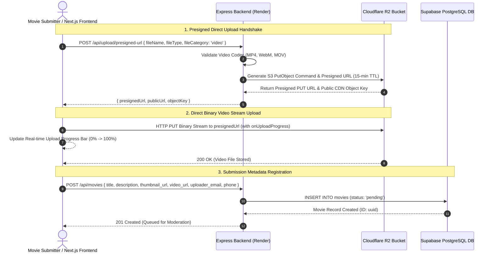

# Thirai+ | Architecture & Core Codebase Documentation

## 1. Architecture & Data Flow (Direct-to-R2 Video Upload)



---

## 2. Database Schema (Supabase PostgreSQL)

```sql
-- Enable UUID Extension
CREATE EXTENSION IF NOT EXISTS "uuid-ossp";

-- Custom Types
CREATE TYPE user_role AS ENUM ('admin', 'judge', 'submitter');
CREATE TYPE movie_status AS ENUM ('pending', 'approved', 'rejected');
CREATE TYPE payment_status AS ENUM ('unpaid', 'paid', 'refunded');

-- 1. Users / Profile Table
CREATE TABLE IF NOT EXISTS public.users (
    id UUID PRIMARY KEY DEFAULT uuid_generate_v4(),
    email VARCHAR(255) UNIQUE NOT NULL,
    full_name VARCHAR(255) NOT NULL,
    role user_role NOT NULL DEFAULT 'submitter',
    profile_pic_url TEXT,
    username VARCHAR(100) UNIQUE,
    password_hash TEXT,
    created_at TIMESTAMP WITH TIME ZONE DEFAULT CURRENT_TIMESTAMP,
    updated_at TIMESTAMP WITH TIME ZONE DEFAULT CURRENT_TIMESTAMP
);

-- 2. Movies Table
CREATE TABLE IF NOT EXISTS public.movies (
    id UUID PRIMARY KEY DEFAULT uuid_generate_v4(),
    title VARCHAR(255) NOT NULL,
    description TEXT NOT NULL,
    thumbnail_url TEXT NOT NULL,
    video_url TEXT NOT NULL,
    attachments JSONB DEFAULT '[]'::jsonb,
    uploader_email VARCHAR(255) NOT NULL,
    uploader_phone VARCHAR(50) NOT NULL,
    status movie_status NOT NULL DEFAULT 'pending',
    rejection_reason TEXT,
    view_count BIGINT DEFAULT 0,
    is_winner BOOLEAN DEFAULT FALSE,
    winner_category VARCHAR(100),
    payment_status payment_status NOT NULL DEFAULT 'unpaid',
    stripe_payment_intent_id VARCHAR(255),
    created_at TIMESTAMP WITH TIME ZONE DEFAULT CURRENT_TIMESTAMP,
    updated_at TIMESTAMP WITH TIME ZONE DEFAULT CURRENT_TIMESTAMP
);

CREATE INDEX idx_movies_status ON public.movies(status);
CREATE INDEX idx_movies_created_at ON public.movies(created_at DESC);

-- 3. Reviews Table (Jury Reviews)
CREATE TABLE IF NOT EXISTS public.reviews (
    id UUID PRIMARY KEY DEFAULT uuid_generate_v4(),
    movie_id UUID NOT NULL REFERENCES public.movies(id) ON DELETE CASCADE,
    judge_id UUID NOT NULL REFERENCES public.users(id) ON DELETE CASCADE,
    score INTEGER NOT NULL CHECK (score >= 1 AND score <= 10),
    comment TEXT NOT NULL,
    is_public BOOLEAN DEFAULT TRUE,
    created_at TIMESTAMP WITH TIME ZONE DEFAULT CURRENT_TIMESTAMP,
    updated_at TIMESTAMP WITH TIME ZONE DEFAULT CURRENT_TIMESTAMP,
    CONSTRAINT unique_movie_judge_review UNIQUE(movie_id, judge_id)
);

-- 4. Payments Table
CREATE TABLE IF NOT EXISTS public.payments (
    id UUID PRIMARY KEY DEFAULT uuid_generate_v4(),
    movie_id UUID REFERENCES public.movies(id) ON DELETE SET NULL,
    stripe_session_id VARCHAR(255) UNIQUE,
    stripe_payment_intent_id VARCHAR(255) UNIQUE,
    amount_cents INTEGER NOT NULL,
    currency VARCHAR(10) DEFAULT 'usd',
    status VARCHAR(50) NOT NULL,
    payer_email VARCHAR(255) NOT NULL,
    created_at TIMESTAMP WITH TIME ZONE DEFAULT CURRENT_TIMESTAMP
);

-- 5. Anti-Spam Community Votes Table
CREATE TABLE IF NOT EXISTS public.community_votes (
    id UUID PRIMARY KEY DEFAULT uuid_generate_v4(),
    movie_id UUID NOT NULL REFERENCES public.movies(id) ON DELETE CASCADE,
    voter_email VARCHAR(255) NOT NULL,
    rating INTEGER NOT NULL CHECK (rating >= 1 AND rating <= 10),
    otp_code VARCHAR(10),
    is_verified BOOLEAN DEFAULT FALSE,
    verified_at TIMESTAMP WITH TIME ZONE,
    ip_address VARCHAR(45),
    created_at TIMESTAMP WITH TIME ZONE DEFAULT CURRENT_TIMESTAMP,
    CONSTRAINT unique_voter_per_movie UNIQUE (movie_id, voter_email)
);
```

---

## 3. Backend Express Routes

### A. R2 Presigned Upload URL Generation (`backend/routes/upload.js`)
```javascript
import express from 'express';
import { PutObjectCommand } from '@aws-sdk/client-s3';
import { getSignedUrl } from '@aws-sdk/s3-request-presigner';
import { r2Client, R2_BUCKET_NAME, R2_PUBLIC_DOMAIN } from '../config/r2.js';
import crypto from 'crypto';

const router = express.Router();

router.post('/presigned-url', async (req, res) => {
  try {
    const { fileName, fileType, fileCategory } = req.body;

    // Codec check for video uploads
    if (fileCategory === 'video') {
      const allowedVideoTypes = ['video/mp4', 'video/webm', 'video/quicktime'];
      if (!allowedVideoTypes.includes(fileType.toLowerCase())) {
        return res.status(400).json({ 
          error: 'Invalid video format. Only MP4, WebM, and MOV codecs are supported.' 
        });
      }
    }

    const fileExtension = fileName.substring(fileName.lastIndexOf('.'));
    const uniqueId = crypto.randomBytes(16).toString('hex');
    const objectKey = `${fileCategory || 'general'}/${Date.now()}-${uniqueId}${fileExtension}`;

    const command = new PutObjectCommand({
      Bucket: R2_BUCKET_NAME,
      Key: objectKey,
      ContentType: fileType,
    });

    const presignedUrl = await getSignedUrl(r2Client, command, { expiresIn: 900 });
    const publicUrl = `${R2_PUBLIC_DOMAIN}/${objectKey}`;

    return res.status(200).json({ success: true, presignedUrl, publicUrl, objectKey });
  } catch (error) {
    return res.status(500).json({ error: 'Failed to generate presigned upload URL.' });
  }
});
```

### B. Admin Moderation Route (`backend/routes/admin.js`)
```javascript
router.put('/movies/:id/moderate', requireAuth(['admin']), async (req, res) => {
  try {
    const { id } = req.params;
    const { status, rejection_reason, is_winner, winner_category } = req.body;

    const updatePayload = {
      status,
      updated_at: new Date().toISOString()
    };

    if (status === 'rejected') {
      updatePayload.rejection_reason = rejection_reason || 'Does not meet festival guidelines.';
    } else if (status === 'approved') {
      updatePayload.rejection_reason = null;
    }

    if (typeof is_winner === 'boolean') {
      updatePayload.is_winner = is_winner;
      updatePayload.winner_category = winner_category || null;
    }

    const { data: updatedMovie, error } = await supabaseAdmin
      .from('movies')
      .update(updatePayload)
      .eq('id', id)
      .select()
      .single();

    if (error) throw error;

    return res.status(200).json({ success: true, movie: updatedMovie });
  } catch (error) {
    return res.status(500).json({ error: 'Failed to update movie moderation status.' });
  }
});
```

---

## 4. Anti-Spam Community Voting Logic (`backend/middleware/antiSpam.js`)

```javascript
import validator from 'validator';

const DISPOSABLE_EMAIL_DOMAINS = new Set([
  'temp-mail.org', 'tempmail.com', '10minutemail.com', 'guerrillamail.com',
  'mailinator.com', 'sharklasers.com', 'dispostable.com', 'getnada.com',
  'trashmail.com', 'yopmail.com', 'crazymailing.com', 'throwawaymail.com',
  'maildrop.cc', 'tempinbox.com', 'minutemail.com', 'fakemailgenerator.com'
]);

export const antiSpamVoterCheck = async (req, res, next) => {
  const { voter_email } = req.body;

  if (!voter_email || typeof voter_email !== 'string') {
    return res.status(400).json({ error: 'Voter email is required.' });
  }

  const cleanEmail = voter_email.trim().toLowerCase();

  if (!validator.isEmail(cleanEmail)) {
    return res.status(400).json({ error: 'Invalid email address format.' });
  }

  const domain = cleanEmail.split('@')[1];
  if (domain && DISPOSABLE_EMAIL_DOMAINS.has(domain)) {
    return res.status(400).json({ 
      error: 'Temporary / disposable email domains are blocked to prevent spam.' 
    });
  }

  req.cleanVoterEmail = cleanEmail;
  next();
};
```
